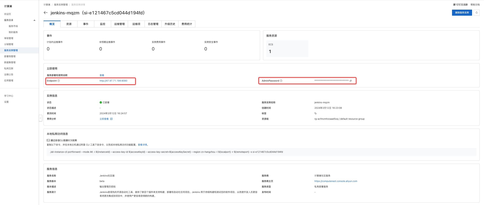

# Jenkins Community Edition Service Instance Deployment Document
## Overview
Jenkins is an open source software project. It is a continuous integration tool based on Java. It is used to monitor continuous repetitive work. It aims to provide an open and easy-to-use software platform so that software projects can be continuously integrated. Jenkins provides the community version service on the computing nest, you can quickly deploy the Jenkins service and implement O & M monitoring on the computing nest without configuring the cloud host, so you can easily build your own applications based on the Jenkins. This topic describes how to activate the Jenkins Community Edition service on the computing nest, as well as the deployment process and usage instructions.
## Billing Description
The cost of the Jenkins Community Edition on the calculation nest mainly involves:

-Selected vCPU and memory specifications
-Disk Capacity
-public network bandwidth

Billing methods include:

-Pay-As-You-Go (hours)
-Package year and package month

The estimated cost can be seen in real time when the instance is created.

## Deployment Architecture
Jenkins Community Edition is a stand-alone deployment architecture.

## Permissions required for RAM accounts
Jenkins services need to access and create resources such as ECS and VPC. If you use a RAM user to create a service instance, you need to add the corresponding resource permissions to the account of the RAM user before creating the service instance. For details about how to add RAM permissions, see [Authorize RAM users](https://help.aliyun.com/document_detail/121945.html). The required permissions are shown in the following table.

| Permission policy name | Comment |
| --- | --- |
| AliyunECSFullAccess | Permissions to manage ECS instances |
| AliyunVPCFullAccess | Permissions to manage a VPC |
| AliyunROSFullAccess | Manage permissions for Resource Orchestration Service (ROS) |
| AliyunComputeNestUserFullAccess | Manage user-side permissions for the compute nest service (ComputeNest) |
| AliyunCloudMonitorFullAccess | Permissions to manage CloudMonitor (CloudMonitor) |

## Deployment process
### Deployment steps
Click [Deployment Link](https://computenest.console.aliyun.com/user/cn-hangzhou/serviceInstanceCreate?ServiceId=service-5789653a5cbe4817a4a7) to enter the service instance deployment page, and fill in the parameters according to the interface prompts to complete the deployment.

### Deployment parameter description
When you create a service instance, you need to configure the service instance information. The details of the input parameters Jenkins the Community Edition service instance are described below.

| Parameter group | Parameter item | Example | Description |
| ------------ | -------- | -------------- | --- |
| Service instance name | | test | Instance name |
| Region | | China (Hangzhou) | Select the region of the service instance. We recommend that you select the region nearby to obtain better network latency. |
| Availability Zone Configuration | Deployment Region | Zone I | Different Availability Zones in a Region |
| Payment Type Configuration | Payment Type | Pay-As-You-Go or Subscription |
| Select an existing basic resource configuration | VPC ID | vpc-xxx | Select the VPC ID. |
| Select the existing basic resource configuration | VSwitch ID | vsw-xxx | Select the VSwitch ID. If the switch cannot be found, try switching the region and zone |
| ECS instance configuration | Instance type | ecs.g6.large | Instance type, which can be selected according to actual needs |
| ECS instance configuration | System disk space | 40 | System disk space can be selected according to actual needs |
| ECS instance configuration | Data disk space | 40 | Data disk space can be selected according to actual needs |
| ECS instance configuration | Instance password | ******** | Set the instance password. It must be 8 to 30 characters in length and must contain three items (uppercase letters, lowercase letters, numbers, ()'~!@#$%^& *-+ ={}[]:;' <>,.?/special symbols) |
| ECS instance configuration | Traffic public network broadband | 100 | Public network broadband, which can be selected according to actual needs |

    

### Validation Results

1. View the service instance.
After the service instance is created successfully, the deployment time takes about 2 minutes. After the deployment is complete, the corresponding service instance is displayed on the page.

    

2. After entering the service instance overview page, you can access jenkins services through Endpoint and AdminPassword.

    

### Use Jenkins
Please visit the Jenkins official website to learn how to use the Jenkins:[Jenkins usage documents](http://www.jenkins.org.cn/)
